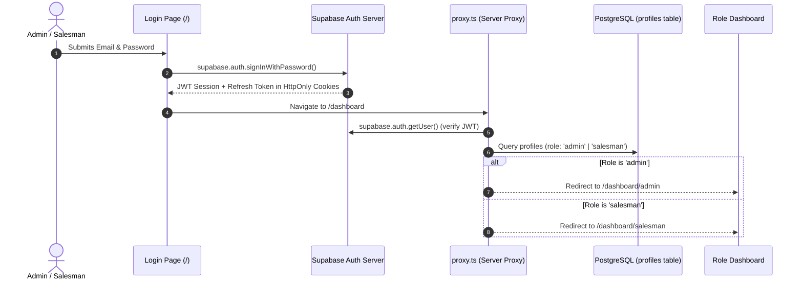
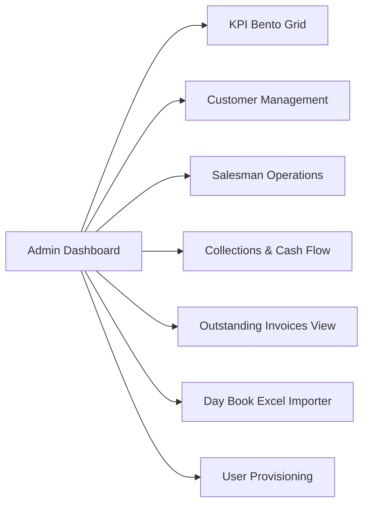
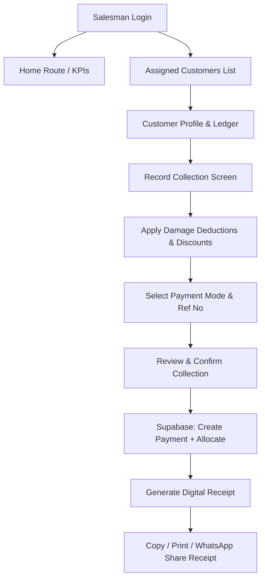
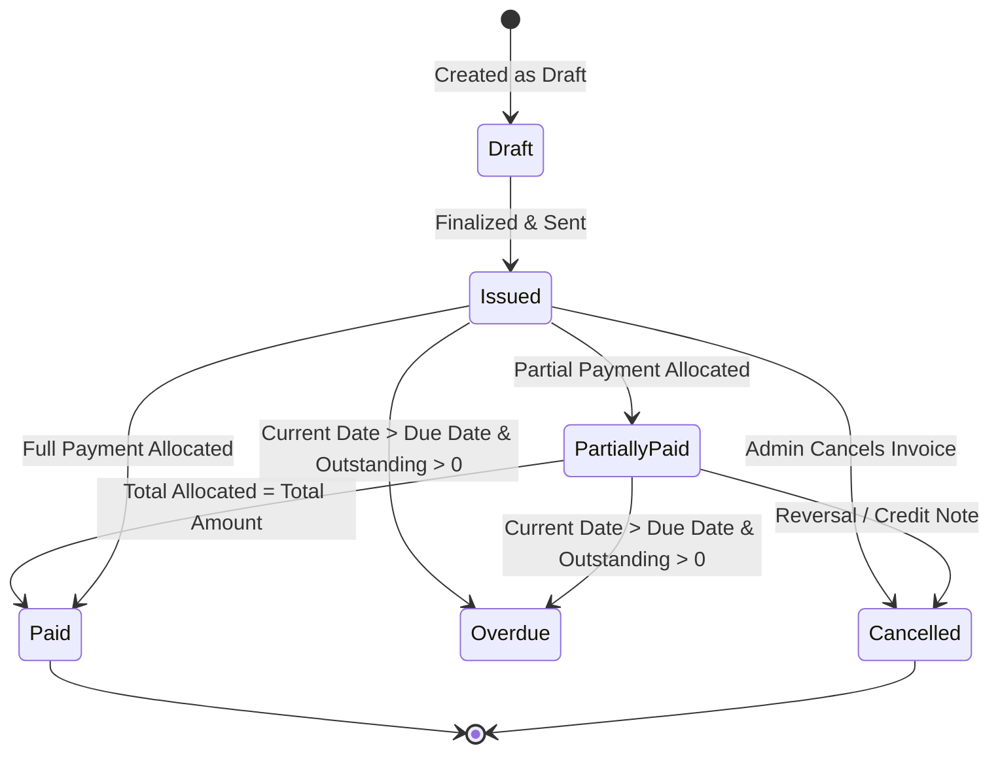
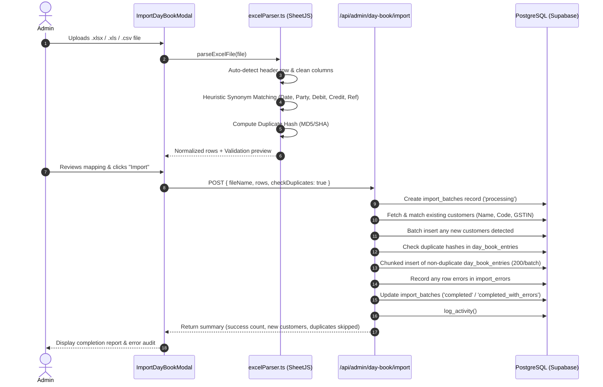
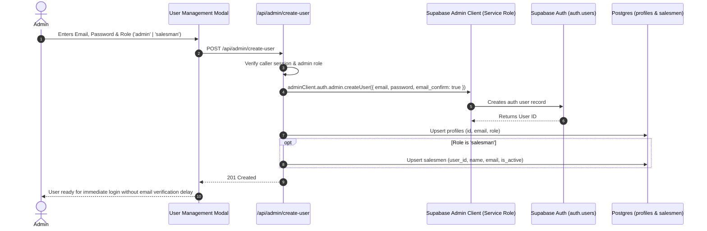
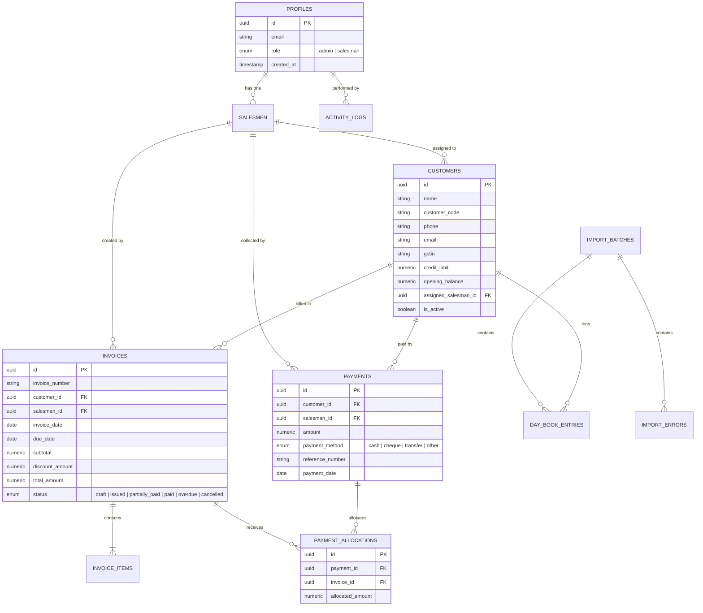

# CBM (Condition-Based Monitoring / ERP) — Complete Architecture & Feature Flow

This document provides a comprehensive end-to-end breakdown of the entire CBM distribution & collection ERP application, explaining every feature, workflow, database relationship, security layer, and state management flow.

---

## Table of Contents

1. [System Overview & Architecture](#1-system-overview--architecture)
2. [Security & Authentication Flow](#2-security--authentication-flow)
3. [Admin ERP Dashboard Flow](#3-admin-erp-dashboard-flow)
4. [Salesman Mobile/Field Dashboard Flow](#4-salesman-mobilefield-dashboard-flow)
5. [Invoicing & Payment Allocation Engine](#5-invoicing--payment-allocation-engine)
6. [Day Book Excel Import Engine](#6-day-book-excel-import-engine)
7. [User Provisioning & Role Management Flow](#7-user-provisioning--role-management-flow)
8. [Database Schema, Views & Stored Procedures](#8-database-schema-views--stored-procedures)
9. [Real-time State Management & Synchronization](#9-real-time-state-management--synchronization)
10. [End-to-End User Journey Walkthrough](#10-end-to-end-user-journey-walkthrough)

---

## 1. System Overview & Architecture

CBM is a enterprise-grade Distribution ERP and Field Collection platform designed for distributors, wholesalers, and sales teams. It manages the full lifecycle of customers, salesman routes, multi-item invoicing, payment collections, and automated Tally/Excel Day Book synchronization.

```mermaid
graph TD
    Client[Next.js 16 App Router] --> Proxy[Server Proxy / Middleware (proxy.ts)]
    Proxy --> SSRAuth[Supabase SSR Session & Cookie Auth]
    Client --> ZustandStore[Zustand Global Store (dashboardStore / authStore)]
    ZustandStore --> ServiceLayer[TypeScript Service Layer]
    ServiceLayer --> SupabaseRPC[Supabase Postgres RPCs & Views]
    ServiceLayer --> SupabaseTables[Supabase Postgres RLS Protected Tables]
    Client --> AdminAPI[Next.js Server API Routes (/api/admin/*)]
    AdminAPI --> AdminClient[Supabase Service Role Client (Admin Auth)]
    SupabaseTables --> RealtimeEngine[Supabase Realtime Pub/Sub]
    RealtimeEngine --> ZustandStore
```

### Key Technologies
- **Frontend Framework**: Next.js 16 (App Router), React 19, TypeScript
- **Styling**: Tailwind CSS with custom ERP color tokens & glassmorphism
- **Backend / Database**: Supabase (PostgreSQL 15+, Row Level Security, RPCs, Stored Procedures, Triggers, Views, Realtime WebSockets)
- **State Management**: Zustand with live Realtime subscription synchronization and debounced cache invalidation
- **File & Excel Processing**: SheetJS (`xlsx`) with heuristic column fuzzy-matching and duplicate hash calculation

---

## 2. Security & Authentication Flow



### Security Layers
1. **Server Proxy Gatekeeper (`proxy.ts`)**:
   - Runs server-side before any page or route renders.
   - Verifies the user JWT from cookies.
   - Queries `profiles.role` to prevent privilege escalation.
   - Route matrix:
     - `/dashboard/admin/*` & `/api/admin/*` &rarr; Strict `admin` role required.
     - `/dashboard/salesman/*` &rarr; Strict `salesman` role required.
     - `/` (login) when logged in &rarr; Auto-redirects to designated role dashboard.
2. **Database Row Level Security (RLS)**:
   - **Admins**: Granted full access (`SELECT`, `INSERT`, `UPDATE`, `DELETE`) across all tables via the `is_admin()` SQL function.
   - **Salesmen**: Strictly limited via `my_salesman_id()` SQL function:
     - Can only view/manage customers where `assigned_salesman_id = my_salesman_id()`.
     - Can only view/create invoices where `salesman_id = my_salesman_id()`.
     - Can only record payments tagged with their own `salesman_id`.
     - Cannot modify or cancel closed invoices.

---

## 3. Admin ERP Dashboard Flow

The Admin Dashboard (`/dashboard/admin`) provides comprehensive visibility into organization-wide distribution metrics, ledger status, team performance, and data imports.



### 1. Executive KPI Bento Grid
- **Today's Sales**: Aggregated live total of all invoices issued on current date.
- **Today's Collections**: Sum of all cash, cheque, and UPI payments received today.
- **Total Outstanding**: Real-time balance sum computed across all uncollected invoices from the `invoice_outstanding` view.
- **Pending Invoices**: Count of invoices in `issued`, `partially_paid`, or `overdue` states.
- **Total Active Customers**: Live count of active customer accounts.
- **MTD Revenue (Month to Date)**: Month-to-date sales total in Lakhs (INR).

### 2. Customer Directory & Ledger
- Search by customer name, code, phone, city, or GSTIN.
- Filter by status (Active / Inactive) or credit risk.
- **Add Customer Modal**: Create accounts with credit limits, opening balances, address, and assigned salesmen.
- Inspect customer transaction history, balance summaries, and contact details.

### 3. Salesman Performance & Tracking
- Directory of field salesmen with assigned accounts and active status.
- Real-time collection numbers and performance metrics per representative.

### 4. Collections & Cash Flow
- Real-time feed of payments with payment mode indicators (`Cash`, `Cheque`, `Bank Transfer`, `UPI`).
- Audit view of multi-invoice allocations and unallocated floats.

### 5. Outstanding & Ageing Analysis
- Powered by the `invoice_outstanding` database view.
- Calculates `days_overdue` and highlights critical credit exposures.

---

## 4. Salesman Mobile/Field Dashboard Flow

Designed as a mobile-first, field-optimized interface (`/dashboard/salesman`) allowing sales representatives to manage their daily collection route on the ground.



### Core Features
1. **Route Customer Listing**:
   - Filter by: `All Accounts`, `Pending Collections`, `Overdue Invoices`, `Zero Balance`.
   - Direct one-tap click-to-call (`tel:` scheme).
   - Quick action to open Collection screen directly from the customer card.
2. **Collection Entry & Discount Processing**:
   - Dynamic balance calculation: `Opening Balance` + `Invoice Amount` - `Previous Payments`.
   - **Discount Engine**: Optional toggle to add:
     - Damage / Return Deductions (INR)
     - Special Promotional Discounts (INR)
     - Live auto-calculation of the Net Payable Amount.
3. **Payment Methods**:
   - `Cash` (Instant receipt generation)
   - `Cheque` (With Cheque number and bank reference)
   - `Bank Transfer / UPI` (With transaction UTR reference)
4. **Digital Receipt Generator**:
   - Generates instant verified collection receipts with unique Receipt IDs (`REC-XXXX`).
   - One-click copy, print, or share summary via messaging apps.
   - Automatically updates the customer's live balance on submission.

---

## 5. Invoicing & Payment Allocation Engine

The financial engine guarantees strict ledger integrity using database-level constraints and triggers.



### Payment Allocation Logic
1. A payment record is inserted into `payments` with an amount and payment method.
2. An allocation is inserted into `payment_allocations` matching `payment_id` to one or more `invoice_id`s.
3. **PostgreSQL Trigger (`recalculate_invoice_status`)**:
   - Validates that total allocations for a payment do not exceed the payment amount.
   - Validates that total allocations for an invoice do not exceed the invoice total.
   - Automatically recalculates and updates the invoice status:
     - If `SUM(allocated_amount) == 0` &rarr; `issued` (or `overdue` if past due date).
     - If `0 < SUM(allocated_amount) < total_amount` &rarr; `partially_paid`.
     - If `SUM(allocated_amount) >= total_amount` &rarr; `paid`.

---

## 6. Day Book Excel Import Engine

The Day Book Import module allows administrators to upload standard ERP Excel exports (such as Tally Day Book, Busy, Marg, or custom spreadsheets) to synchronize hundreds of transactions in seconds.



### Heuristic Column Mapping Table
| Target ERP Field | Synonyms & Detected Headers | Type / Format |
|---|---|---|
| `transaction_date` | `transaction date`, `date`, `txn date`, `voucher date`, `dt`, `posting date` | `YYYY-MM-DD` (Handles Excel serials, DD/MM/YYYY, ISO) |
| `voucher_ref` | `reference no`, `voucher ref`, `vch no`, `invoice no`, `bill no`, `doc no` | String |
| `customer_name` | `party name`, `party`, `customer name`, `ledger name`, `account name`, `client` | String (Normalized & trimmed) |
| `particulars` | `particulars`, `description`, `narration`, `remarks`, `details`, `item description` | String |
| `debit` | `debit`, `dr`, `dr amount`, `debit amount`, `sales amount` | Numeric (Sanitized) |
| `credit` | `credit`, `cr`, `cr amount`, `credit amount`, `received amount` | Numeric (Sanitized) |
| `balance` | `balance`, `closing balance`, `net balance`, `bal` | Numeric |

---

## 7. User Provisioning & Role Management Flow

Creating new Admin or Salesman users requires privileged credentials handled securely through a server-side route.



---

## 8. Database Schema, Views & Stored Procedures



### Stored Procedures & Database Functions
- `get_dashboard_stats()`: Single-query atomic retrieval of all 6 KPI cards, respecting user role context.
- `get_sales_trend(p_start_date, p_end_date)`: Generates continuous daily sales aggregates, filling gaps with zero.
- `get_activity_feed(p_limit, p_offset)`: Paginated system audit log entries.
- `log_activity(...)`: Autonomous logging helper for audit trails.
- `recalculate_invoice_status()`: Trigger function maintaining invoice settlement state.
- `my_salesman_id()`: RLS helper resolving the authenticated user's salesman ID.
- `is_admin()`: RLS helper resolving whether caller has admin privileges.

---

## 9. Real-time State Management & Synchronization

The application implements a real-time reactive model where changes in the database propagate automatically to all connected clients.

```mermaid
graph TD
    DBChange[Postgres Write: INSERT / UPDATE / DELETE] --> SupabaseRealtime[Supabase Realtime Engine]
    SupabaseRealtime --> ChannelSub[WebSocket Channel: 'dashboard-realtime']
    ChannelSub --> Debounce[150ms Debounced Invalidator]
    Debounce --> Refresh[dashboardStore.refresh()]
    Refresh --> FetchStats[get_dashboard_stats RPC]
    Refresh --> FetchEntities[getCustomers / getInvoices / getPayments]
    FetchEntities --> UIUpdate[React UI Re-renders automatically]
```

---

## 10. End-to-End User Journey Walkthrough

### Scenario A: Sales Representative Daily Route
1. **Login**: Salesman enters credentials at `/` and is routed to `/dashboard/salesman`.
2. **Customer Visit**: Salesman selects a customer from their list, checks their pending balance and past receipts.
3. **Record Collection**:
   - Opens the collection screen.
   - Enters the collected amount (e.g. ₹5,000 cash).
   - Applies any agreed damage deduction (e.g. ₹200).
   - Reviews the calculated net settlement and submits.
4. **Instant Receipt**: A verified digital receipt is shown. The salesman shares it with the customer over WhatsApp or prints it.
5. **Real-time Synchronization**: The payment immediately reflects on the Admin dashboard.

### Scenario B: Administrator Monthly ERP Sync
1. **Login**: Admin logs in at `/` and lands on `/dashboard/admin`.
2. **Day Book Import**:
   - Admin opens the **Import Day Book** tool.
   - Drops the latest Tally / Excel export file.
   - The parser automatically detects column headers, parses dates, and sanitizes amounts.
   - Admin reviews the validation summary (e.g. 150 rows valid, 4 new customers detected, 2 duplicate vouchers skipped).
   - Clicks **Start Import**.
3. **Automated Ledger Update**:
   - Missing customer profiles are created automatically.
   - Day book records are batch-inserted in chunks.
   - The executive KPI cards and total outstanding metrics refresh instantly across all dashboards.

---

*Generated for the CBM Distribution & Condition-Based Monitoring Management System.*
